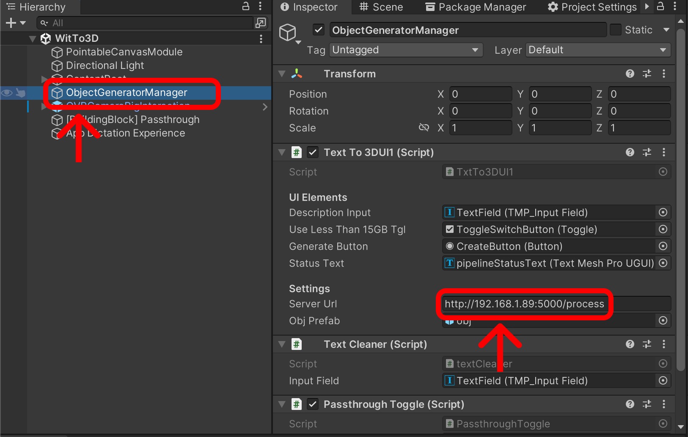

# XR-App-for-Mental-Health

## Requisiti

Prima di fare la build del progetto, assicurarsi di potersi collegare correttamente al server:

- Selezionare l'oggetto ObjectGeneratorManager
- Controllare che il Server URL sia lo stesso visualizzato sul Server
