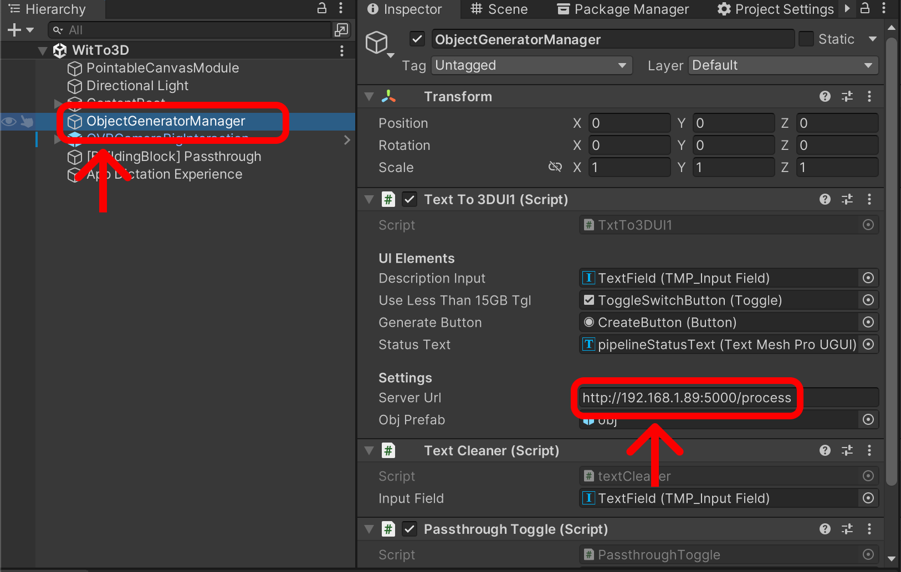

# Generative AI for Mental Health in XR

Questo progetto di tesi esplora l'integrazione della **Generative AI (GAI)** in ambienti di **Extended Reality (XR)** per il supporto alla salute mentale. L'applicazione permette agli utenti di interagire con un ambiente virtuale rilassante, generando oggetti 3D tramite comandi vocali o testuali e integrando elementi del mondo reale tramite Mixed Reality.

## 🚀 Funzionalità Principali

- **Voice-to-3D Generation**: Integrazione con Meta Wit.ai per convertire comandi vocali in prompt per la generazione di mesh 3D.
- **Text-to-3D Panel**: Interfaccia UI dedicata per l'inserimento di prompt testuali e la visualizzazione dello stato di generazione.
- **Mixed Reality (Passthrough)**: Switch dinamico tra realtà virtuale e realtà aumentata tramite il supporto OVRPassthrough di Meta Quest.
- **Immersive Environments**: Scena "Zen Island" progettata per il rilassamento e la meditazione.
- **Dynamic Loading**: Sistema di download e istanziazione runtime di modelli GLB/GLTF partendo da un server remoto.

## 🛠️ Tech Stack

- **Engine**: Unity 2022.3.46f1
- **Render Pipeline**: Universal Render Pipeline (URP)
- **SDK**: Meta XR Integration SDK (Oculus)
- **AI/ML**: Wit.ai (Meta) per il Natural Language Processing
- **Backend Bridge**: Integrazione tramite Python Server (Flask/FastAPI) per la pipeline di generazione 3D
- **Utilities**: [GLTFUtility](https://github.com/siccity/GLTFUtility) per il caricamento runtime dei modelli

## 📂 Struttura del Progetto

- `XR-App/Assets/Scripts`: Logica core per la comunicazione col server, gestione audio e toggle passthrough.
- `XR-App/Assets/Scenes`: Scene principali (`WitTo3D`, `IslandScene`).
- `XR-App/Assets/Models`: Risorsa di asset 3D pre-caricati.
- `GAI FOR MENTAL HEALTH IN XR - PRESENTATION.pdf`: Presentazione dettagliata del progetto di tesi.

## ⚙️ Setup e Installazione

1. **Prerequisiti**:
   - Unity Hub installato con versione **2022.3.46f1**.
   - Meta Quest 3 o Meta Quest Pro.

2. **Configurazione Server**:
   Prima di eseguire la build, è fondamentale configurare l'URL del server che gestisce la pipeline di generazione:
   - Apri il progetto in Unity.
   - Trova e seleziona l'oggetto `GeneratorManager` (o `ObjectGeneratorManager`) nella scena.
   - Nel componente `TextTo3DUI`, aggiorna il campo **Server URL** con l'indirizzo IP del tuo server locale o remoto.

   

3. **Build**:
   - Imposta la piattaforma su **Android** tramite Build Settings.
   - Assicurati che le scene siano incluse nel build index.
   - Esegui la build e installa l'APK sul visore tramite SideQuest o Meta Quest Link.

## 📖 Utilizzo

1. Avvia l'app sul visore.
2. Utilizza il pulsante dedicato per attivare il microfono e descrivere l'oggetto che desideri generare (es. "Genera un piccolo alberello").
3. In alternativa, usa il pannello UI per digitare il prompt.
4. Usa il toggle "Passthrough" per visualizzare l'oggetto nel tuo ambiente reale o tornare nell'isola virtuale.

---
*Progetto realizzato da Enrico Madonna per la tesi di laurea.*
